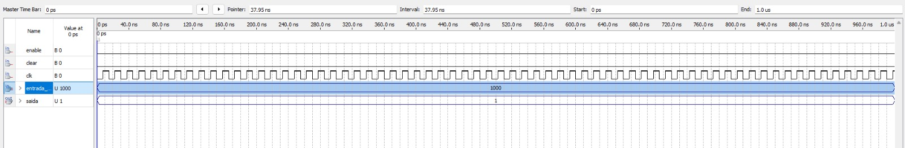
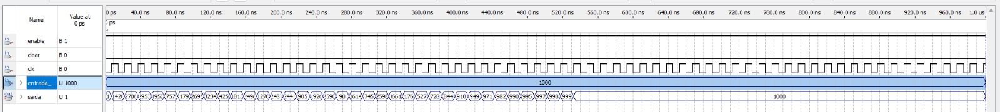
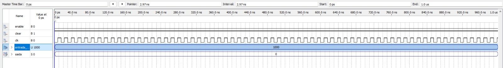

# Controlador PI em VHDL

Este projeto implementa um controlador Proporcional-Integral (PI) simples em VHDL. O design calcula a saída de controle com base no sinal de entrada usando constantes proporcionais (Kp) e integrais (Ki) pré-definidas. Ele recebe um sinal de entrada digital e gera uma saída correspondente para controlar um sistema baseado em feedback.

## Visão Geral

### Funcionalidades
- **Controle Proporcional (P) e Integral (I)**: O controlador PI calcula os termos proporcional e integral com base no erro entre o sinal de entrada e o feedback.
- **Aritmética de Ponto Fixo**: Para evitar operações em ponto flutuante, os valores de Kp e Ki são multiplicados por 10, e o resultado final é dividido conforme necessário.
- **Sinais de Controle**: O design inclui sinais de clock, enable e clear para controlar o comportamento do loop PI.

## Entradas e Saídas

- **`clk`**: Sinal de clock (20Hz na placa alvo).
- **`enable`**: Habilita o controlador PID.
- **`clear`**: Limpa os registradores internos (feedback e soma dos erros).
- **`entrada_std[7:0]`**: Valor de entrada de 8 bits.
- **`saida[7:0]`**: Valor de saída de 8 bits.

## Mapeamento de Pinos

| Sinal            | Pino FPGA       |
|------------------|-----------------|
| `clk`            | P1              |
| `clear`          | N25             |
| `enable`         | N26             |
| `entrada_std`    | P25, AE14, AF14, AD13, AC13, B13, A13, N1 |
| `saida`          | AE23, AF23, AB21, AC22, AD22, AD23, AD21, AC21 |

## Sinais Internos

- **`erro_atual`**: Erro atual (diferença entre entrada e feedback).
- **`erro_soma`**: Soma dos erros usada para a parte integral.
- **`p`**: Termo proporcional calculado como `Kp * erro`.
- **`i`**: Termo integral calculado como `Ki * soma_dos_erros`.
- **`realimentacao_reg`**: Sinal de feedback armazenado para o próximo ciclo.
- **`output_val_int`**: Valor resultante da saída do controlador PI.
- **`output_loaded`**: Combinação dos termos proporcional e integral.

## Operação

1. **Cálculo do Erro**: O erro é calculado como a diferença entre o sinal de entrada e o feedback (saída anterior).
2. **Termos Proporcional e Integral**: O termo proporcional é diretamente proporcional ao erro atual, enquanto o termo integral é baseado na acumulação dos erros passados.
3. **Saída do PI**: Os termos proporcional e integral são somados para calcular o sinal de controle final, que é usado como feedback no próximo ciclo.
4. **Reset**: Se o sinal `clear` estiver alto, os registradores internos são resetados.
5. **Enable**: A lógica de controle só atualiza a saída quando o sinal `enable` está ativo.

## Simulação

A imagem a seguir ilustra o funcionamento do controlador PI durante uma simulação:

- Se enable desativado

- Se enable ativado

- Se clear ativado

## Constantes

- **`con_kp`**: Constante proporcional (`Kp = 0.1`) escalada por 10.
- **`con_ki`**: Constante integral (`Ki = 0.5`) escalada por 10.
- **`tempo_divi`**: Divisor de tempo para ajustar a constante de tempo da integral.
